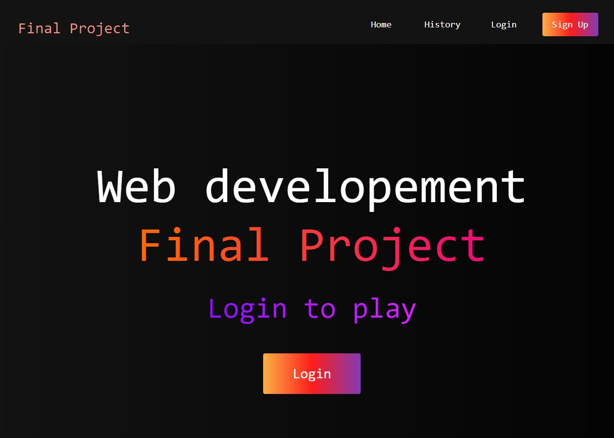

# WEB GAME



## Overview

- **Final Project**: Final project web server course. Built in PHP using MVC pattern.

- **Team developer**: Ronald Mercado - Thiago Soarez - Anh Khoi.

- **Game**: 3 levels to play. Organize numbers, letters and more.

- **User Authentication**: Application manage session by user.

## Installation

Clone the repository:

```bash
git clone https://github.com/ronaldmh/PHPWebGame.git
```
Start the local server and access the game through your web browser:
```bash
http://localhost/web-game/index.php

```

## Usage
The game consists of multiple levels, each with its own unique challenges. Your goal is to complete each level by achieving specific objectives or reaching the endpoint.

## Features
- Multiple challenging levels.
- Intuitive.
- Engaging gameplay.
- Responsive design for various screen sizes.


## Contribution

Contributions are welcome! If you'd like to contribute to this project, please follow these steps:

Fork the repository.

Create a new branch for your feature or bug fix: git checkout -b feature/your-feature-name.

Make your changes and commit them: git commit -m 'Add some feature'.

Push to the branch: git push origin feature/your-feature-name.

Create a pull request.

## License

This project is licensed under the MIT License - see the LICENSE file for details.

## Contact

If you have any questions or suggestions, please feel free to contact me at ronaldmh20@gmail.com


# End
